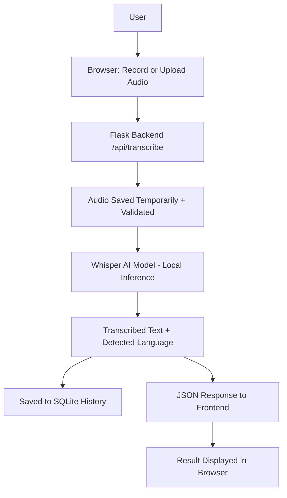

# Internship Project Report

## 1. Project Title
**AI Speech-to-Text Converter** - A Web Application for Converting
Spoken Audio into Text Using a Pretrained AI Model

## 2. Introduction
Speech is one of the most natural ways humans communicate, but many
digital workflows still rely on typed text - note-taking, subtitling,
accessibility tools, and documentation, among others. This project
implements a web-based application that allows a user to speak into
their microphone (or upload an existing audio file) and receive an
accurate text transcription, powered by a modern AI speech-recognition
model running locally on the user's own machine.

## 3. Problem Statement
Manually transcribing audio recordings into text is slow, tedious,
and error-prone when done by hand. Many existing cloud-based
speech-to-text services require a paid subscription, an internet
connection for every request, and raise privacy concerns since audio
is sent to a third-party server. There is a need for a simple,
self-contained, free tool that can transcribe speech locally without
relying on a paid API.

## 4. Objectives
- Build a Flask-based web application with a clean, responsive UI.
- Allow audio input via both microphone recording and file upload.
- Integrate a pretrained AI speech-recognition model (Whisper) that
  runs entirely on the local machine, requiring no paid API key.
- Support transcription in multiple languages, specifically English
  and Hindi, with automatic language detection as an option.
- Store a session history of transcriptions using a lightweight local
  database (SQLite).
- Provide clear error handling and validation for unsupported or
  corrupted files.
- Document the system thoroughly for beginner developers to run and
  understand.

## 5. Existing System
Most currently available speech-to-text tools fall into two
categories:
1. **Built-in OS/phone dictation features** - convenient but not
   embeddable into a custom application or workflow.
2. **Cloud APIs** (e.g. commercial speech-to-text services) - powerful
   and accurate, but typically require a paid subscription, an API
   key, and sending user audio to an external server, which is a
   privacy concern for sensitive recordings.

There is limited tooling aimed specifically at beginners who want a
**free, local, self-hosted** speech-to-text web app they can run,
inspect, and extend themselves.

## 6. Proposed System
This project proposes a self-contained Flask web application that:
- Runs entirely on the user's own computer (no cloud dependency after
  the one-time model download).
- Uses **OpenAI Whisper**, an openly available pretrained model, for
  the actual speech recognition, avoiding the need for any paid API
  key.
- Provides a modern, mobile-friendly interface for recording,
  uploading, transcribing, and reviewing past transcriptions.
- Is structured using standard software engineering practices
  (separation of concerns between routes, services, models, and
  database layers) so it is easy to read, test, and extend.

## 7. Technologies Used
- **Backend:** Python 3.11+, Flask
- **AI Model:** OpenAI Whisper (local inference, `base` model by default)
- **Audio decoding:** FFmpeg
- **Database:** SQLite (Python standard library `sqlite3`)
- **Frontend:** HTML5, CSS3, vanilla JavaScript (MediaRecorder API for
  microphone capture)
- **Testing:** pytest

## 8. System Requirements

**Hardware**
- A computer capable of running Python and PyTorch (a modern laptop/
  desktop with at least 8GB RAM is recommended for smooth performance)
- A working microphone (for the recording feature)

**Software**
- Windows 10/11 (instructions target Windows, but the app also runs
  on macOS/Linux with equivalent commands)
- Python 3.11 or newer
- FFmpeg
- A modern web browser (Chrome, Edge, or Firefox) that supports the
  MediaRecorder Web API

## 9. System Architecture

The system follows a classic three-tier structure:
1. **Presentation layer** - HTML/CSS/JavaScript running in the browser.
2. **Application layer** - Flask routes and services handling requests,
   validation, and orchestration.
3. **Data layer** - SQLite database storing transcription history.

## 10. Modules

| Module                              | Responsibility                                   |
|--------------------------------------|---------------------------------------------------|
| `app.py`                             | Application factory, startup, route registration  |
| `config.py`                          | Centralized configuration values                  |
| `database/database.py`               | SQLite connection and schema management            |
| `models/transcription.py`            | Transcription record CRUD operations               |
| `services/speech_to_text.py`         | Whisper model loading and inference                |
| `routes/transcription_routes.py`     | HTTP endpoints (pages + JSON API)                   |
| `templates/`                         | Server-rendered HTML pages                          |
| `static/`                            | CSS styling and client-side JavaScript              |
| `tests/test_app.py`                  | Automated tests for routes and validation           |

## 11. Implementation
The application follows a request/response cycle typical of a Flask
web app. The frontend uses the browser's `MediaRecorder` API to
capture microphone audio as a Blob, or accepts a user-selected file
via a standard file input. Either way, the audio is sent to the
`/api/transcribe` endpoint as `multipart/form-data`.

On the backend, the file is validated (extension whitelist, size
limit enforced by Flask's `MAX_CONTENT_LENGTH`, and an empty-file
check), saved temporarily with a randomly generated filename to avoid
collisions or path traversal issues, passed to the Whisper model for
inference, and then immediately deleted regardless of whether
transcription succeeded or failed. The resulting text, along with
metadata (word count, character count, detected language), is saved
to a SQLite database and returned to the frontend as JSON, which then
updates the page without a full reload.

## 12. AI/ML Methodology
This project uses **inference only** - it loads Whisper's publicly
released pretrained weights and applies the model to new audio; it
does **not** perform any training or fine-tuning. Internally, Whisper
is an encoder-decoder Transformer: the encoder converts a log-Mel
spectrogram of the audio into a sequence of hidden representations,
and the decoder autoregressively generates text tokens conditioned on
those representations, optionally guided by a specified target
language.

## 13. Dataset
A small **sample/reference dataset** (`dataset/sample_transcriptions.csv`)
is included to illustrate the structure a real speech dataset would
have (audio filename, transcription, language). This dataset is
**not** used anywhere in the application's runtime logic and does
**not** train the Whisper model - Whisper's weights were pretrained by
OpenAI on a separate, much larger proprietary dataset before this
project ever used them. See `dataset/README.md` for a discussion of
how a real public dataset (e.g. LibriSpeech) could be used for further
experimentation.

## 14. Results
The application successfully:
- Accepts and transcribes audio recorded via microphone.
- Accepts and transcribes uploaded audio files in WAV, MP3, M4A,
  FLAC, and OGG formats.
- Produces reasonably accurate transcriptions for clear English and
  Hindi speech using Whisper's `base` model.
- Correctly detects the spoken language when "Auto Detect" is
  selected.
- Persists and displays transcription history across multiple
  requests within a running session.
- Returns clear, human-readable error messages for unsupported file
  types, oversized files, and audio with no detectable speech.

Exact transcription accuracy varies with audio clarity, background
noise, accent, and the Whisper model size chosen, consistent with
Whisper's publicly documented performance characteristics.

## 15. Advantages
- **No paid API key required** - all inference happens locally.
- **Privacy-friendly** - audio never leaves the user's computer.
- **Multilingual** - supports English, Hindi, and auto-detection.
- **Beginner-friendly codebase** - clearly separated modules, heavily
  commented, no hidden "magic".
- **Extensible** - new languages, models, or export formats can be
  added without restructuring the project.

## 16. Limitations
- Local inference speed depends on the user's CPU; without a GPU,
  larger Whisper models (`medium`, `large`) can be slow.
- The first run requires an internet connection to download Whisper's
  model weights.
- Transcription accuracy can degrade with heavy background noise,
  overlapping speakers, or strong accents not well represented in
  Whisper's training data.
- History is stored per-machine in a local SQLite file, not
  synchronized across devices or tied to individual user accounts.

## 17. Future Scope
- Add support for additional languages supported by Whisper.
- Add real-time/streaming transcription as the user speaks.
- Add user authentication so multiple people can maintain separate
  histories on a shared deployment.
- Allow exporting the full history to PDF or CSV.
- Add a settings page to switch Whisper model size from the UI.

## 18. Conclusion
This project demonstrates a complete, practical application of a
pretrained AI model within a full-stack web application. It shows how
a modern deep learning model (Whisper) can be integrated into a
standard Flask backend and consumed by a lightweight, responsive
frontend, while following good engineering practices such as input
validation, error handling, and separation of concerns - all without
requiring any paid cloud service.

## 19. References
- OpenAI Whisper: https://github.com/openai/whisper
- OpenAI Whisper Paper - "Robust Speech Recognition via Large-Scale
  Weak Supervision": https://cdn.openai.com/papers/whisper.pdf
- Flask Documentation: https://flask.palletsprojects.com/
- LibriSpeech Dataset: https://www.openslr.org/12
- Python `sqlite3` Documentation: https://docs.python.org/3/library/sqlite3.html
- MDN Web Docs - MediaRecorder API:
  https://developer.mozilla.org/en-US/docs/Web/API/MediaRecorder
