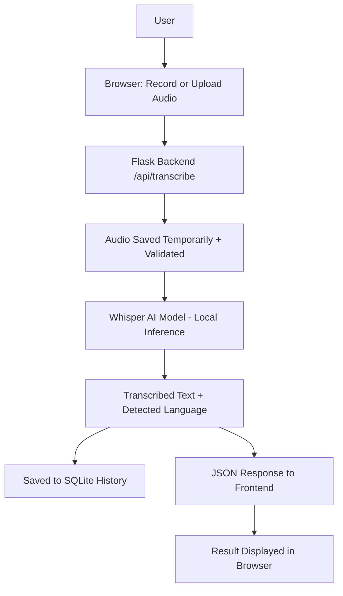

# AI Speech-to-Text Converter

A local, beginner-friendly web application that converts spoken audio
(recorded from your microphone or uploaded as a file) into written
text, using OpenAI's **Whisper** AI model running entirely on your own
computer. No paid API key is required.

---

## Features

- 🎤 Record speech directly from your microphone in the browser
- 📁 Upload an existing audio file (WAV, MP3, M4A, FLAC, OGG)
- 🧠 Transcribe audio using a real local AI speech-recognition model (Whisper)
- 🌐 Choose English, Hindi, or Auto-Detect language
- 📋 Copy the transcribed text with one click
- ⬇️ Download the transcription as a `.txt` file
- 🗂️ View a history of everything transcribed this session (stored in SQLite)
- ⚠️ Clear, friendly error messages when audio can't be understood
- 📱 Clean, modern, responsive UI that works on desktop and mobile

---

## Technologies Used

| Layer          | Technology                          |
|----------------|--------------------------------------|
| Backend        | Python 3.11+, Flask                  |
| AI Model       | OpenAI Whisper (local, pretrained)   |
| Database       | SQLite (via Python's built-in `sqlite3`) |
| Frontend       | HTML5, CSS3, vanilla JavaScript      |
| Audio decoding | FFmpeg (used internally by Whisper)  |
| Testing        | pytest                               |

---

## Project Structure

```
Speech-to-Text-AI/
│
├── app.py                        # Flask application entry point
├── requirements.txt               # Python dependencies
├── README.md                      # This file
├── .gitignore
├── config.py                      # Central app configuration
├── INTERNSHIP_PROJECT_REPORT.md   # Formal project report
│
├── database/
│   └── database.py                # SQLite connection + schema setup
│
├── models/
│   └── transcription.py           # Transcription data access (CRUD)
│
├── services/
│   └── speech_to_text.py          # Whisper AI integration
│
├── routes/
│   └── transcription_routes.py    # All Flask URL routes (pages + API)
│
├── templates/
│   ├── index.html                 # Main dashboard page
│   └── history.html               # Transcription history page
│
├── static/
│   ├── css/style.css              # Styling
│   └── js/script.js               # Recording, upload, API calls
│
├── uploads/                       # Temporary audio storage (auto-cleaned)
├── outputs/                       # Generated .txt downloads
│
├── dataset/
│   ├── README.md                  # Explains the sample dataset
│   └── sample_transcriptions.csv  # Sample reference dataset
│
└── tests/
    └── test_app.py                # Automated tests
```

---

## How It Works

### 1. What is Speech-to-Text?
Speech-to-Text (also called Automatic Speech Recognition, or ASR) is
the process of converting spoken audio into written text. You've
likely used it already in voice assistants, live captioning, or
voice-typing features on your phone.

### 2. What is AI doing in this project?
The actual conversion of "sound" into "words" is done by a neural
network - specifically **Whisper**, created by OpenAI. This project's
Flask code does not do any speech recognition itself; its job is to
receive your audio, hand it to the Whisper model, and display the
result. The "intelligence" lives entirely inside the pretrained model.

### 3. What is Whisper?
Whisper is an open-source neural network trained by OpenAI on a huge,
diverse dataset of multilingual audio paired with its transcriptions.
Because it was trained on so much varied speech, it generalizes well
to new voices, accents, background noise, and even multiple languages
- including English and Hindi, used in this project.

### 4. How audio is processed
When you record or upload audio, the browser/Flask sends the raw audio
file to the server. Whisper uses **FFmpeg** internally to decode that
file (regardless of whether it's WAV, MP3, M4A, FLAC, or OGG) into raw
audio samples, resamples it to 16kHz, and converts it into a
**log-Mel spectrogram** - a visual/numerical representation of the
sound's frequencies over time, which is what the neural network
actually reads.

### 5. How speech is converted into text
The spectrogram is fed through Whisper's encoder-decoder transformer
network. The encoder builds a rich numerical understanding of the
audio, and the decoder generates text one token (roughly, one word
piece) at a time, predicting the most likely next word based on both
the audio and the words it has already produced.

### 6. What language detection does
If you choose "Auto Detect", Whisper first analyzes a short sample of
the audio to estimate which language is most likely being spoken,
then transcribes the full audio using that language. If you explicitly
select English or Hindi, Whisper skips detection and transcribes
directly in that language, which is usually faster and more accurate.

### 7. Why preprocessing may be required
Real-world audio varies enormously - different file formats, sample
rates, volumes, and channel counts (mono vs stereo). Preprocessing
(format decoding, resampling to 16kHz, converting to a spectrogram)
normalizes all of that into the exact numerical shape the model
expects, so it can produce reliable results regardless of how the
original audio was recorded.

### 8. How the Flask backend communicates with the frontend
The frontend (JavaScript) sends the audio file to the backend using a
`fetch()` call with `multipart/form-data` to the `/api/transcribe`
endpoint. Flask processes it and responds with **JSON** (e.g.
`{ "success": true, "transcription": {...} }`), which the JavaScript
then reads and uses to update the page - no full page reload needed.

### 9. How the complete system works (architecture)



---

## Installation (Windows)

### Prerequisites

1. **Install Python 3.11 or newer**
   Download from [python.org](https://www.python.org/downloads/) and
   make sure you check **"Add Python to PATH"** during installation.

2. **Install FFmpeg** (required by Whisper to decode audio files)

   The easiest way on Windows is with the `winget` package manager
   (built into Windows 10/11):

   ```
   winget install "FFmpeg (Essentials Build)"
   ```

   Alternatively:
   - Download a build from https://www.gyan.dev/ffmpeg/builds/ (choose the "essentials" build)
   - Extract the ZIP somewhere permanent, e.g. `C:\ffmpeg`
   - Add `C:\ffmpeg\bin` to your Windows **PATH** environment variable
     (Search "Environment Variables" in the Start Menu → Edit the
     `Path` variable → New → paste the folder path)
   - Open a **new** terminal and confirm it worked: `ffmpeg -version`

### Project Setup

3. **Extract the ZIP file** you downloaded (`Speech-to-Text-AI.zip`) to
   a folder of your choice, e.g. `C:\Projects\Speech-to-Text-AI`.

4. **Open the project folder in VS Code**
   `File → Open Folder... → select Speech-to-Text-AI`

5. **Open a terminal in VS Code**
   `Terminal → New Terminal` (it should already be inside the project folder)

6. **Create a virtual environment**
   ```
   python -m venv venv
   ```

7. **Activate the virtual environment**
   ```
   venv\Scripts\activate
   ```
   You should now see `(venv)` at the start of your terminal prompt.

8. **Install the requirements**
   ```
   pip install -r requirements.txt
   ```
   This step downloads Flask, PyTorch, and Whisper - it can take
   several minutes and needs a good internet connection since PyTorch
   is a large package.

9. **Run the Flask application**
   ```
   python app.py
   ```
   The first time you transcribe audio, Whisper will automatically
   download its model weights (~140MB for the "base" model) - this
   also requires internet access, but only happens once.

10. **Open the app in your browser**
    Go to: **http://127.0.0.1:5000**

---

## Usage

1. On the **Home** page, either:
   - Click **Start Recording**, speak, then click **Stop Recording**, or
   - Click **Upload Audio File** and choose a file from your computer.
2. Choose a language from the dropdown (**English**, **Hindi**, or
   **Auto Detect**).
3. Click **Transcribe Audio** and wait for the AI to process it.
4. Your transcription appears in the result box, along with the word
   count, character count, and detected language.
5. Use **Copy Text** to copy it to your clipboard, or **Download TXT**
   to save it as a file.
6. Visit the **History** page to see, download, or delete previous
   transcriptions from this session.

---

## Dataset

See [`dataset/README.md`](dataset/README.md) for a full explanation.
In short: `dataset/sample_transcriptions.csv` is a small
**reference/sample** dataset showing what speech datasets typically
look like. It is **not** used to train Whisper in this project -
Whisper arrives already pretrained by OpenAI.

---

## AI/ML Concepts

See the **"How It Works"** section above for a full explanation of
Speech-to-Text, Whisper, audio preprocessing, and language detection.

---

## API Endpoints

| Method | Endpoint                        | Description                                    |
|--------|----------------------------------|-------------------------------------------------|
| GET    | `/`                              | Home page (record/upload + transcribe UI)        |
| GET    | `/history`                       | History page                                     |
| POST   | `/api/transcribe`                | Upload audio, returns transcription JSON          |
| GET    | `/api/history`                   | Returns all saved transcriptions as JSON          |
| DELETE | `/api/history/<id>`              | Deletes a transcription record                    |
| GET    | `/api/download/<id>`             | Downloads a transcription as a `.txt` file        |

**Example response from `POST /api/transcribe`:**
```json
{
  "success": true,
  "transcription": {
    "id": 1,
    "original_filename": "recording.webm",
    "language": "auto",
    "detected_language": "en",
    "transcription": "Hello, this is a test recording.",
    "word_count": 6,
    "character_count": 34,
    "created_at": "2026-01-15 10:32:00"
  }
}
```

---

## Troubleshooting

**"ffmpeg not found" / audio fails to process**
FFmpeg is not installed or not on your PATH. Follow the FFmpeg
installation steps above, then open a **new** terminal (PATH changes
don't apply to already-open terminals) and try again.

**`pip install -r requirements.txt` fails or is very slow**
PyTorch is a large download (700MB+). Make sure you have a stable
internet connection. If installation still fails, try upgrading pip
first: `python -m pip install --upgrade pip`.

**The first transcription takes a long time**
This is expected - the first time you transcribe, Whisper downloads
its model weights and loads them into memory. Subsequent
transcriptions in the same run will be much faster.

**"No speech could be detected in this audio file"**
Try a louder, clearer recording, make sure your microphone is
correctly selected in Windows sound settings, or try a different
audio file.

**Microphone recording doesn't work**
Browsers require microphone permission and, for security reasons,
often require the page to be served from `localhost` or `https://` -
running the app at `http://127.0.0.1:5000` (as this project does)
satisfies that requirement. Make sure you clicked "Allow" when your
browser asked for microphone access.

**The app is slow on my computer**
The Whisper `base` model (the default here) is chosen for a good
balance of speed and accuracy on CPU-only computers. If it's still too
slow, open `config.py` and change `WHISPER_MODEL_SIZE` to `"tiny"`
for faster (but less accurate) results.

**Lightweight alternative to Whisper**
If Whisper/PyTorch is too heavy for your machine, you can swap
`services/speech_to_text.py` to use the `SpeechRecognition` Python
package with Google's free Web Speech API instead - it requires
internet access per request but has no heavy local model to load:
```
pip install SpeechRecognition
```
```python
import speech_recognition as sr

def transcribe_audio_lightweight(file_path, language="en-US"):
    recognizer = sr.Recognizer()
    with sr.AudioFile(file_path) as source:
        audio = recognizer.record(source)
    return recognizer.recognize_google(audio, language=language)
```
Note: this lightweight path only accepts WAV audio directly, and
sends your audio to Google's servers rather than processing it
locally.

---

## Future Improvements

- Support for more languages beyond English and Hindi
- Speaker diarization (labeling "who said what")
- Real-time (streaming) transcription while recording
- User accounts so history persists per-user instead of per-machine
- Export history to PDF or CSV
- Punctuation and formatting cleanup pass on the raw transcription

---

## Screenshots

_Add screenshots of the running application here, for example:_

```


```

Create a `screenshots/` folder in the project root and place your own
`.png` images there, then reference them as shown above.

---

## License

This project is provided for educational purposes. Whisper is
released by OpenAI under the MIT License.
